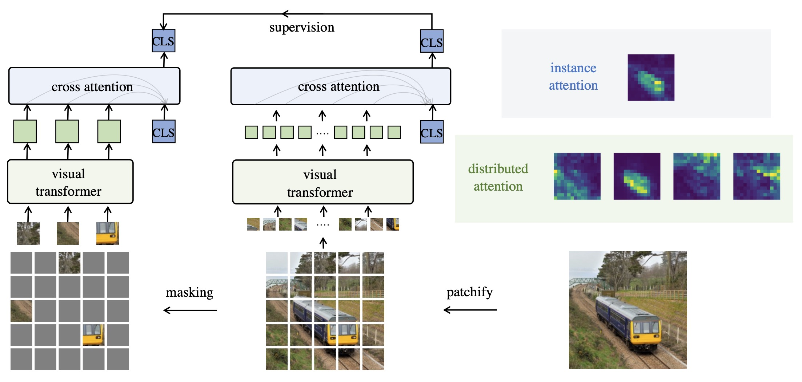

# Extreme Masking for Learning Instance and Distributed Visual Representations

This repo constains the official pytorch implementation for the ExtreMA paper [(arxiv)](https://arxiv.org/abs/2206.04667). ExtreMA explores to treat spatial token masking as a data augmentation for siamese representation learning. It follows the plain BYOL model with supervision created from the masking operation. ExtreMA not only learns a strong instance representation which captures the holistic image, but also meaningful distributed representations for each individual tokens. Multi-masking which processes a paralleled number of masks is developed to greatly accelerate training.

<p align="center">
  
</p>


## Released Pretrained Model

We release the following 4 representative models at the moment. The wall time is measured by a single node of 8xV100 GPUs with Pytorch environment 1.13. ExtreMA is signficantly more efficient and faster than competing masked modeling and siamese representation learning approaches.

| name | pretrain dataset | epochs | masking | color-aug | wall time | linear | finetune | link |
| :---: | :---: | :---: | :---: | :---: | :---: | :---: | :---: |  :---: |
| ViT-Base | ImageNet-1K | 300 | 80%x5 | No  | 50 hrs | 67.1 | 82.9| [full ckpt](https://frontiers.blob.core.windows.net/pretraining/checkpoints/extrema/extrema_mask08x5_1k_300ep.pth) |
| ViT-Base | ImageNet-1K | 300 | 80%x5 | Yes | 50 hrs | 73.3 | 83.7| [full ckpt](https://frontiers.blob.core.windows.net/pretraining/checkpoints/extrema/extrema_mask08x5_color_1k_300ep.pth) |
| ViT-Base | ImageNet-1K | 300 | 90%x8 | Yes | 46 hrs | 68.4 | 83.5| [full ckpt](https://frontiers.blob.core.windows.net/pretraining/checkpoints/extrema/extrema_mask09x8_color_1k_300ep.pth) |
| ViT-Base | ImageNet-22K | 30 | 80%x5 | Yes | 56 hrs | 74.5 | 83.9| [full ckpt](https://frontiers.blob.core.windows.net/pretraining/checkpoints/extrema/extrema_mask08x5_color_22k_30ep.pth) |

## Pre-training

To train ExtreMA, follow the command:

```
python -m torch.distributed.launch --nproc_per_node=8 main.py \
  -a vit_base -b 2048 \
  --lr=1.5e-4 --weight-decay=.1 --weight-decay-end=.1 \
  --opt=adamw \
  --aug-spatialconsistent-color \
  --loss byol \
  --epochs=300 --warmup-epochs=40 --save-freq 5 \
  --opt-betas 0.9 0.95 \
  --drop_path_rate 0.1 --attn_drop_rate 0. \
  --layer_scale_init_value 0.1 --class_attention_layers 2 \
  --mask-ratio 0.8 --num-masks 5 \
  --ema-momentum 0.996 \
  --proj-dim 256 \
  --dist-url 'tcp://localhost:10001' \
  --multiprocessing-distributed \
  --seed 0 \
  --log_dir $LOG_DIR \
  --output_dir $SAVE_DIR \
  $DATA_DIR \
```

## Linear and Finetuning Evaluations on ImageNet-1k

To linear probe a pretrained model,
```
python -m torch.distributed.launch --nproc_per_node=8 main_lincls.py \
  -a vit_base --lr 0.1 \
  -b 4096 --optimizer sgd --warmup-epochs 10 \
  --log_dir ./ --eval_momentum \
  --dist-url 'tcp://localhost:10001' \
  --multiprocessing-distributed  \
  --pretrained $MODEL \
  $DATA
```

To finetune the model end-to-end,
```
python -m torch.distributed.launch --nproc_per_node=8 finetune/run_class_finetuning.py  \
  --model vit_base_patch16_224  \
  --data_path $DATA_DIR  \
  --use_mean_pooling \
  --color_jitter 0.4 --reprob 0.25 \
  --finetune $MODEL  --output_dir $LOG_DIR   \
  --layer_decay 0.65 \
  --lr 5e-4  \
  --batch_size 128 --update_freq 1 --opt adamw --opt_betas 0.9 0.999   \
  --weight_decay 0.05 --warmup_epochs 5 --drop_path 0.2 --epochs 100 \
  --dist_eval \
```
The finetuning code is based on BEiT, with important modifications of removing the [cls] token at the ViT input.

## Other Downstream Evaluations

For semantic segmentation and instance detection, we follow [the CAE codebase](https://github.com/lxtGH/CAE). Care must be taken to remove the [cls] token at the input for ExtreMA.

## Acknowledgement

The ExtreMA code sigificantly borrows content from MoCo-v3, MAE, BEiT and the timm library.

## Citation

```
@article{wu2022extreme,
  title={Extreme Masking for Learning Instance and Distributed Visual Representations},
  author={Wu, Zhirong and Lai, Zihang and Sun, Xiao and Lin, Stephen},
  journal={arXiv preprint arXiv:2206.04667},
  year={2022}
}
```

## Contributing

This project welcomes contributions and suggestions.  Most contributions require you to agree to a
Contributor License Agreement (CLA) declaring that you have the right to, and actually do, grant us
the rights to use your contribution. For details, visit https://cla.opensource.microsoft.com.

When you submit a pull request, a CLA bot will automatically determine whether you need to provide
a CLA and decorate the PR appropriately (e.g., status check, comment). Simply follow the instructions
provided by the bot. You will only need to do this once across all repos using our CLA.

This project has adopted the [Microsoft Open Source Code of Conduct](https://opensource.microsoft.com/codeofconduct/).
For more information see the [Code of Conduct FAQ](https://opensource.microsoft.com/codeofconduct/faq/) or
contact [opencode@microsoft.com](mailto:opencode@microsoft.com) with any additional questions or comments.

## Trademarks

This project may contain trademarks or logos for projects, products, or services. Authorized use of Microsoft 
trademarks or logos is subject to and must follow 
[Microsoft's Trademark & Brand Guidelines](https://www.microsoft.com/en-us/legal/intellectualproperty/trademarks/usage/general).
Use of Microsoft trademarks or logos in modified versions of this project must not cause confusion or imply Microsoft sponsorship.
Any use of third-party trademarks or logos are subject to those third-party's policies.
